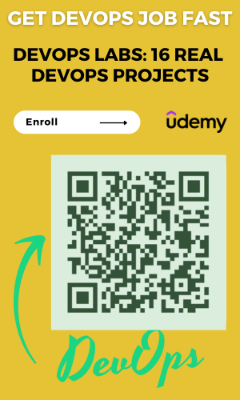
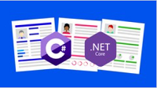
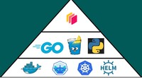
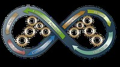

# Hello Γειά σου Guten Tag Hola Olá Ciao おはよう 안녕하세요 Dag Bonjour Привет नमस्ते Chào مرحبًا 咩事 您好 😎

<!-- - [👍😊 Brian Su ](#-brian-su-)
  - [My Udemy courses](#my-udemy-courses)
  - [My languages](#my-languages)
  - [My updates](#my-updates)
- [🥇🔑 Tech Stack](#-tech-stack)
- [💳📈 Github Stats](#-github-stats)
- [💰🧧 If you would like to help me or support me](#-if-you-would-like-to-help-me-or-support-me) -->

<!--
01: English: Hello
02: Greek: Γειά σου
03: German: Guten Tag / Hi / Hallo
04: Spanish: Hola
05: Portuguese: Olá
06: Italian: Ciao
07: Japanese: おはよう
08: Korean: 안녕하세요
09: Dutch: Dag / Hoi / Hallo
10: French: Bonjour
11: Russian: Привет
12: Hindi: नमस्ते
13: Cantonese: 咩事
14: Mandarin: 您好

...

15: Vietnamese: Xin chào
16: Arabic: مرحبًا
-->

## 👍😊 Brian Su <!-- Ich bin -->

<!-- Sono Brian Su -->

<!-- <table style="border: 0; border-collapse: collapse;">
    <tr>
        <td style="padding: 0; margin: 0;">
            
        </td>
        <td style="padding: 0; margin: 0;">
            
        </td>
        <td style="padding: 0; margin: 0;">
            
        </td>
    </tr>
</table> -->

<!-- Section 1: My Udemy Courses -->

### My Udemy Courses

<table style="width: 100%; border-collapse: collapse;">
  <!-- row 1 -->
  <tr>
    <td style="border: 1px solid black; padding: 15px; text-align: left;">
        

            
        

        

            <a href="https://www.udemy.com/course/guru-golang/" target="go">Guru Golang Job Interviews</a>
        

    </td>
    <td style="border: 1px solid black; padding: 15px; text-align: left;">
        

            
        

        

            <a href="https://www.udemy.com/course/nail-nodejs/" target="nodejs">Nail Node.js Job Interviews</a>
        

    </td>
    <td style="border: 1px solid black; padding: 15px; text-align: left;">
        

            
        

        

            <a href="https://www.udemy.com/course/ace-angular/" target="angular">Ace Angular Job Interviews</a>
        

    </td>
    <td style="border: 1px solid black; padding: 15px; text-align: left;">
        

            
        

        

            <a href="https://www.udemy.com/course/crack-csharop-dotnet" target="csharp">Crack C# .NET Job Interviews</a>
        

    </td>
  </tr>
  <!-- row 2 -->
  <tr>
    <td style="border: 1px solid black; padding: 15px; text-align: left;">
        

            
        

        

            <a href="https://www.udemy.com/course/mendix-magic/" target="mendix">Mendix Magic</a>
        

    </td>
    <td style="border: 1px solid black; padding: 15px; text-align: left;">
        

            
        

        

            <a href="https://www.udemy.com/course/struts-savvy-quickstart-your-java-projects/" target="struts">Struts Savvy</a>
        

    </td>
    <td style="border: 1px solid black; padding: 15px; text-align: left;">
        

            
        

        

            <a href="https://www.udemy.com/course/react-rapidstart-creating-an-responsive-react-app-in-1-hour/" target="react">React Rapid</a>
        

    </td>
    <td style="border: 1px solid black; padding: 15px; text-align: left;">
        

            
        

        

            <a href="https://www.udemy.com/course/maven-mastery-kickstart-your-java-projects/" target="maven">Maven Mastery</a>
        

    </td>
  </tr>
  <!-- row 3 -->
  <tr>
    <td style="border: 1px solid black; padding: 15px; text-align: left;">
        

            
        

        

            <a href="https://www.udemy.com/course/devops-labs-16-real-devops-projects/" target="devops16">16 Real DevOps Projects</a>
        

    </td>
    <td style="border: 1px solid black; padding: 15px; text-align: left;">
        

            
        

        

            <a href="https://www.udemy.com/course/managing-dask-kubernetes-with-kubectl-python-and-go/" target="k8s">Kubernetes Python and Go</a>
        

    </td>
    <td style="border: 1px solid black; padding: 15px; text-align: left;">
        

            
        

        

            <a href="https://www.udemy.com/course/devops-labs-9-real-devops-projects/" target="devops9">9 Real DevOps Projects</a>
        

    </td>
    <td style="border: 1px solid black; padding: 15px; text-align: left;">
        

            
        

        

            <a href="https://www.udemy.com/course/spring-mvc-mastery-jumpstart-your-java-projects/" target="soringmvc">Spring MVC Mastery</a>
        

    </td>
  </tr>
  <!-- row 4 -->
  <tr>
    <td style="border: 1px solid black; padding: 15px; text-align: left;">
        

            
        

        

            <a href="https://www.udemy.com/course/it-contractor-google-cloud-gcp-interview-questions-20xx/" target="gcp">Google Cloud Interview Questions</a>
        

    </td>
    <td style="border: 1px solid black; padding: 15px; text-align: left;">
        

            
        

        

            <a href="https://www.udemy.com/course/it-contractor-behavioral-interview-questions-20xx/" target="bahavioral">IT Behavioral Interview Questions</a>
        

    </td>
    <td style="border: 1px solid black; padding: 15px; text-align: left;">
        

            
        

        

            <a href="https://www.udemy.com/course/devops-interview-questions-20xx/" target="devops-iwq">DevOps Interview Questions</a>
        

    </td>
    <td style="border: 1px solid black; padding: 15px; text-align: left;">
        

            
        

        

            <a href="https://www.udemy.com/course/perfect-python/" target="python">Perfect Python Job Interviews</a>
        

    </td>
  </tr>
  <!-- row 5 -->
  <!-- <tr>
    <td style="border: 1px solid black; padding: 15px; text-align: left;">
        

    </td>
    <td style="border: 1px solid black; padding: 15px; text-align: left;">
        

    </td>
    <td style="border: 1px solid black; padding: 15px; text-align: left;">
            

    </td>
    <td style="border: 1px solid black; padding: 15px; text-align: left;">
            

    </td>
  </tr> -->
</table>

<!--
Steps for making the course image here:

- Download logo from "Course landing page" https://www.udemy.com/instructor/courses/
- Rename to "Udemy/ad_200x112_???.jpg"
- The size needs to be 200x112 (if needed, edit and resize to 200x112)
- Verify/Test
- Upload
- Update the db.json
-->

<!-- Section 2: My Languages -->

### My Languages

<table style="border-collapse: collapse; width: 100%;">
    <tr>
        <td style="border: 1px solid black;"></td>
        <td style="border: 1px solid black;"></td>
        <td style="border: 1px solid black;"></td>
        <td style="border: 1px solid black;"></td>
        <td style="border: 1px solid black;"></td>
        <td style="border: 1px solid black;"></td>
        <td style="border: 1px solid black;"></td>
        <td style="border: 1px solid black;"></td>
    </tr>
    <tr>
        <td style="border: 1px solid black;"></td>
        <td style="border: 1px solid black;"></td>
        <td style="border: 1px solid black;"></td>
        <td style="border: 1px solid black;"></td>
        <td style="border: 1px solid black;"></td>
        <td style="border: 1px solid black;"></td>
        <td style="border: 1px solid black;"></td>
        <td style="border: 1px solid black;"></td>
    </tr>
</table>

<!--
https://vectorflags.com
https://www.vecteezy.com
https://www.freeflagicons.com
-->

<!-- Section 3: My Sponsors -->

### My Sponsors

[Become My Sponsor 😊](https://github.com/sponsors/briansu2004)

<!-- [Displaying a sponsor button in your repository](https://docs.github.com/en/repositories/managing-your-repositorys-settings-and-features/customizing-your-repository/displaying-a-sponsor-button-in-your-repository) -->

<!-- Section 4: My Updates -->

### My Updates

<!--
- 🔭 I'm currently coding.
- 🌱 I'm currently learning more about history.
- 👯 I'm looking to collaborate on [GitHub](https://github.com/briansu2004).
- 🤔 I'm looking for help with running faster.
- 💬 Ask me about any tech-related stuff.
- 📫 How to reach me: briansu2004@hotmail.com 
- ⚡ Fun fact: I am good at math and singing 
-->

<!-- - My family has 3 major issues now 😭😭😭 Very difficult time since the beginning of 2023 and new year of rabbit -->

<!--  -->

- 🔭 I'm currently making my udemy courses and learning Cantonese, Japanese, Korean, Spanish, Italian, Portuguese, Greek, German, Dutch, French, Russian, Hindi, Vietnamese and Arabic - total 16 speaking languages!

  [My Udemy Courses](https://myudemycourses.netlify.app/)

  <!-- [Ace IT Job Interview Courses](https://www.youtube.com/@AceITJobInterviewCourses-ok4gn) -->

  Ace IT Job Interview Courses 

  <!-- 
  @AceITJobInterviewCourses-ok4gn 
  https://www.youtube.com/@AceITJobInterviewCourses-ok4gn
  https://www.youtube.com/channel/UCPQaJmElLBya7vliMk1E1Sg
  -->

- My upcoming Udemy courses (WIP):

  [Pass PHP Job Interviews](Coming Soon)
  
  [Conquer C++ Job Interviews](Coming Soon)

  [Ace Gen AI Job Interviews](Coming Soon)

  <!-- [Master JavaScript Job Interviews](Coming Soon) -->

  [Master React Job Interviews](Coming Soon)

  [Nail Next.js Job Interviews](Coming Soon)

  <!-- 
  [Angular Mastery: Kickstart Your Full Stack Projects](Coming Soon)

  [VUE Mastery: Quickstart Your Full Stack Projects](Coming Soon)

  [NPM Mastery: Kickstart Your NodeJS Projects](Coming Soon)

  [PIP Mastery: Kickstart Your Python Projects](Coming Soon)

  [Go module Mastery: Kickstart Your Go Projects](Coming Soon)

  [NuGet Mastery: Kickstart Your C# Projects](Coming Soon)

  [Gradle Mastery: Kickstart Your Java Projects](Coming Soon) 
  -->

  [NoSQL - MongoDB](Coming soon)

  [Open-Source PostgreSQL](coming soon)

  [Full Stack Managing Dask Kubernetes](Coming soon)

  [Full Stack Managing Kubernetes : From Local to Azure](Coming soon)

  [DevOps Labs: 18 Real DevSecOps Projects](Coming soon)

  <!-- [IT Contractor Success: Thriving in Toronto, Canada](Coming soon) -->

  <!-- [New course](https://www.udemy.com/user/brian-su-18/) -->

<!-- 
- My 25th Udemy course:

  [?](https://www.udemy.com/course/)
-->

- My 24th Udemy course:

  [Perfect Python Job Interviews](https://www.udemy.com/course/perfect-python/)

- My 23rd Udemy course:

  [Crack C# .NET Job Interviews](https://www.udemy.com/course/crack-csharop-dotnet/)

- My 22nd Udemy course:

  [Ace Angular Job Interviews](https://www.udemy.com/course/ace-angular/)

- My 21st Udemy course:

  [Nail Node.js Job Interviews](https://www.udemy.com/course/nail-nodejs/)

- My 20th Udemy course:

  [Guru Golang Job Interviews](https://www.udemy.com/course/guru-golang/)

- My 19th Udemy course:

  [Mendix Magic: Mobilize Your Responsive Apps with No Code](https://www.udemy.com/course/mendix-magic/)

  This is the best Mendix course in Udemy and maybe all over the world!

- My 18th Udemy course:

  [Spring MVC Mastery: Jumpstart Your Java Projects](https://www.udemy.com/course/spring-mvc-mastery-jumpstart-your-java-projects/)

- My 17th Udemy course:

  [Struts Savvy: Quickstart Your Java Projects](https://www.udemy.com/course/struts-savvy-quickstart-your-java-projects/)

- My 16th Udemy course:

  [React Mastery: Rapidstart Your Responsive App](https://www.udemy.com/course/react-rapidstart-creating-an-responsive-react-app-in-1-hour/)

<!-- [React Rapidstart: Creating an Responsive React App in 1 hour](https://www.udemy.com/course/react-rapidstart-creating-an-responsive-react-app-in-1-hour/) -->

- My 15th Udemy course:

  [Maven Mastery: Kickstart Your Java Projects](https://www.udemy.com/course/maven-mastery-kickstart-your-java-projects/)

- My 14th Udemy course:

  [Ace Your Google Cloud (GCP) Job Interviews](https://www.udemy.com/course/it-contractor-google-cloud-gcp-interview-questions-20xx/)

  <!-- - My 13th Udemy course:

    [IT Contractor Angular Interview Questions (2023)](https://www.udemy.com/course/it-contractor-angular-interview-questions-20xx/)

  - My 12th Udemy course:

    [IT Contractor .Net and C# Interview Questions (2023)](https://www.udemy.com/course/it-contractor-net-and-c-interview-questions-20xx/) -->

- My 11th Udemy course:

  <!-- [IT Contractor Interview Questions (2023)](https://www.udemy.com/course/it-contractor-interview-questions-20xx) -->

  [IT Interview Questions](https://www.udemy.com/course/it-contractor-interview-questions-20xx/)

- My 10th Udemy course:

  <!-- [IT Contractor Behavioral Interview Questions (2023)](https://www.udemy.com/course/it-contractor-behavioral-interview-questions-20xx) -->

  [IT Behavioral Interview Questions](https://www.udemy.com/course/it-contractor-behavioral-interview-questions-20xx/)

- My 9th Udemy course:

  [DevOps Interview Questions](https://www.udemy.com/course/devops-interview-questions-20xx/)

- My 8th Udemy course:

  <!-- [Managing Dask Kubernetes with Kubectl, Python and Go](https://www.udemy.com/course/managing-dask-kubernetes-with-kubectl-python-and-go/) -->

  [Efficient Kubernetes Management with Python and Go](https://www.udemy.com/course/managing-dask-kubernetes-with-kubectl-python-and-go/)

- My 7th Udemy course:

  [DevOps Labs: 16 Real DevOps Projects](https://www.udemy.com/course/devops-labs-16-real-devops-projects/)

- My 6th Udemy course:

  [DevOps Labs: 15 Real DevSecOps Projects](https://www.udemy.com/course/devops-labs-15-real-devsecops-projects/)

- My 5th Udemy course:

  [DevOps Labs: 12 Real DevSecOps Projects](https://www.udemy.com/course/devops-labs-12-real-devsecops-projects/)

- My 4th Udemy course:

  [DevOps Labs: 14 Real DevOps Projects](https://www.udemy.com/course/devops-labs-14-real-devops-projects/)

- My 3rd Udemy course:

  [DevOps Labs: 9 Real DevOps Projects](https://www.udemy.com/course/devops-labs-9-real-devops-projects/)

- My 2nd Udemy course:

  [DevOps Labs: 6 Real DevOps Projects](https://www.udemy.com/course/devops-labs-6-real-devops-projects/)

- My 1st Udemy course:

  [DevOps Labs: 3 Real DevOps Projects](https://www.udemy.com/course/devops-labs-9-real-devops-projects-free-version/)

- 📫 How to reach me: <briansu2004@hotmail.com> 

- ⚡ Fun fact: I am good at math and singing 

<!--  -->

<!--
briansu2004@hotmail.com

 
 
-->

<!--
- 👯 I'm looking to collaborate on ...
- 🤔 I'm looking for help with ...
- 😄 Pronouns: ...
- ⚡ Fun fact: ...
-->

## 🥇🔑 Tech Stack

<!--

  
  
  
  
   
   
   
   

-->

<!-- https://ileriayo.github.io/markdown-badges/ -->

      
  
   
  
      
 

<!--
            
    
   
      
    
  
      
    
  
-->

<!--
     

 
-->

<!--
## Skills

- Dev
- Cloud
- DevOps
- AI
- Full Stack
- Big Data
- Data Science
- Machine Learning
- Java
- Python
- Scala
- JavaScript
- C#
- Go
- Shell
- Node.js
- AWS
- Azure
- GCP
- Salesforce
- OpenShift
- IBM
- React
- Angular
- Docker
- Kubernetes
- GitHub
- GitLab
- Spark
- Kafka
- Cassandra
-->

<!--

## My GitHub

-->

<!-- Profile Summary Card -->

## 💳📈 Github Stats

<!--

 
 

-->

<!-- 

 

 -->

<!--  -->

<!--
## ✍️👩‍💻 Random Dev Quote

-->

## 💰🧧 If you would like to help me or support me

 

<!--  -->

<!-- paypal.me/briansu2004 -->

<!-- json server

https://raw.githubusercontent.com/briansu2004/briansu2004/main/db.json

==>

https://my-json-server.typicode.com/briansu2004/briansu2004

https://my-json-server.typicode.com/briansu2004/briansu2004/myUdemyCourses
-->
