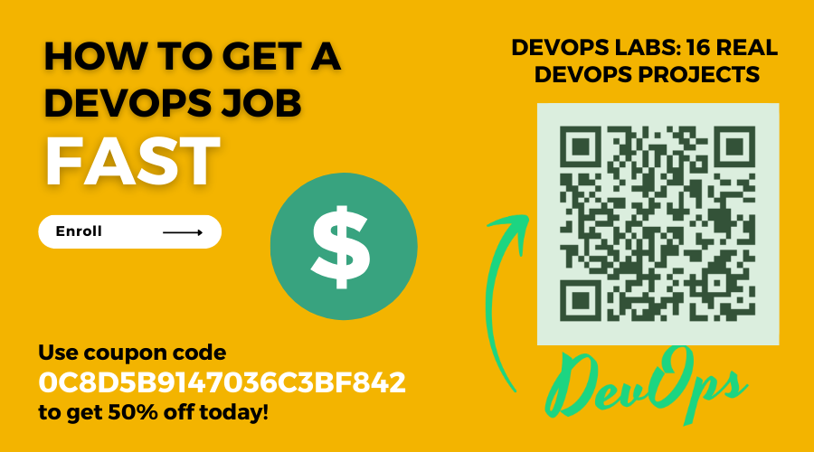

# Hello Bonjour Hola Olá Ciao おはよう 안녕하세요 Hallo 您好 😎

## 👍😊 Sono Brian Su

<!--   -->

<!--  -->

<!--
- 🔭 I'm currently coding.
- 🌱 I'm currently learning more about history.
- 👯 I'm looking to collaborate on [GitHub](https://github.com/briansu2004).
- 🤔 I'm looking for help with running faster.
- 💬 Ask me about any tech-related stuff.
- 📫 How to reach me: briansu2004@hotmail.com 
- ⚡ Fun fact: I am good at math and singing 
-->

- My family has 3 major issues now 😭😭😭 Very difficult time since the beginning of 2023 and new year of rabbit

- 🔭 I'm currently making my udemy courses  and learning Japanese, Korean, Italian, Portuguese, Spanish and Dutch

  - My next Udemy courses (WIP):
  
      [IT Contractor Success: Thriving in Toronto, Canada](Coming soon)

      [Full Stack Managing Kubernetes : From Local to Azure](Coming soon)

      [DevOps Labs: 18 Real DevSecOps Projects](Coming soon)

  - My 7th Udemy course:
  
      [DevOps Labs: 16 Real DevOps Projects](https://www.udemy.com/course/devops-labs-16-real-devops-projects/)

  - My 6th Udemy course:

      [DevOps Labs: 15 Real DevSecOps Projects](https://www.udemy.com/course/devops-labs-15-real-devsecops-projects/)

  - My 5th Udemy course:

      [DevOps Labs: 12 Real DevSecOps Projects](https://www.udemy.com/course/devops-labs-12-real-devsecops-projects/)

  - My 4th Udemy course:
  
      [DevOps Labs: 14 Real DevOps Projects](https://www.udemy.com/course/devops-labs-14-real-devops-projects/)

  - My 3rd Udemy course:

      [DevOps Labs: 9 Real DevOps Projects](https://www.udemy.com/course/devops-labs-9-real-devops-projects/)

  - My 2nd Udemy course:

      [DevOps Labs: 6 Real DevOps Projects](https://www.udemy.com/course/devops-labs-6-real-devops-projects/)

  - My 1st Udemy course:

      [DevOps Labs: 3 Real DevOps Projects](https://www.udemy.com/course/devops-labs-9-real-devops-projects-free-version/)

- 📫 How to reach me: briansu2004@hotmail.com 

- ⚡ Fun fact: I am good at math and singing 

<!--  -->

<!--
briansu2004@hotmail.com

 
 
-->

<!--
- 👯 I'm looking to collaborate on ...
- 🤔 I'm looking for help with ...
- 😄 Pronouns: ...
- ⚡ Fun fact: ...
-->

## 🥇🔑 Tech Stack

<!--

  
  
  
  
   
   
   
   

-->

<!-- https://ileriayo.github.io/markdown-badges/ -->

      
  
   
  
      
 

<!--
            
    
   
      
    
  
      
    
  
-->

<!--
     

 
-->

<!--
## Skills

- Dev
- Cloud
- DevOps
- AI
- Full Stack
- Big Data
- Data Science
- Machine Learning
- Java
- Python
- Scala
- JavaScript
- C#
- Go
- Shell
- Node.js
- AWS
- Azure
- GCP
- Salesforce
- OpenShift
- IBM
- React
- Angular
- Docker
- Kubernetes
- GitHub
- GitLab
- Spark
- Kafka
- Cassandra
-->

<!--

## My GitHub

-->

<!-- Profile Summary Card -->

## 💳📈 Github Stats

<!--

 
 

-->

  <!--
    
  -->
 

<!--
## ✍️👩‍💻 Random Dev Quote

-->

## 💰🧧 If you would like to help me or support me

 

<!--  -->
  
<!-- paypal.me/briansu2004 -->